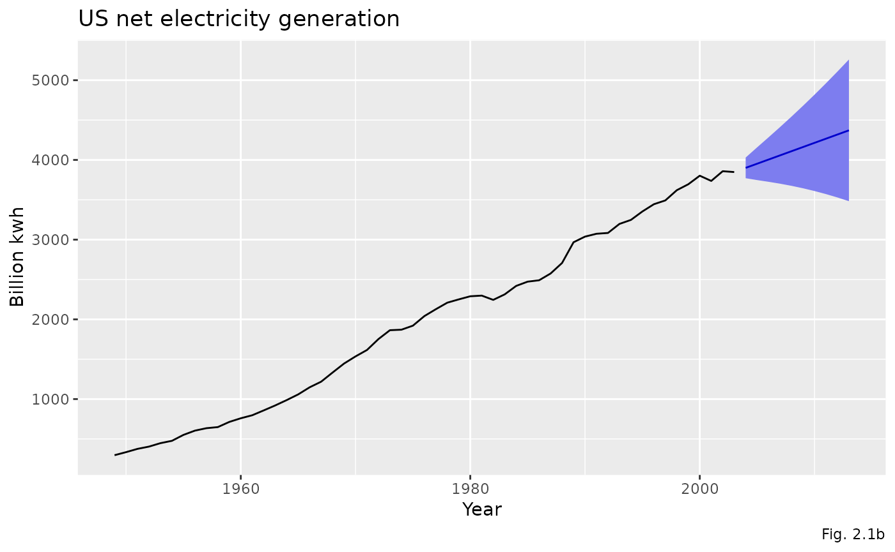

# Using expsmooth: worked examples

## Introduction

This package contains a collection of datasets that are designed to
accompany the book “Forecasting with Exponential Smoothing: The State
Space Approach” by Rob J Hyndman, Anne B Koehler, J Keith Ord, and Ralph
D Snyder (Springer, 2008). The book can be purchased
[here](https://pkg.robjhyndman.com/expsmooth/articles/www.amazon.com/dp/3540719164).

[](https://robjhyndman.com/expsmooth/)

When the `expsmooth` package is loaded, the `forecast` package is also
loaded, providing the functions to fit and forecast with exponential
smoothing state space models.

This vignette will replicate **Section 2.8** from the book, and provide
worked solutions to some of the exercises in **Section 2.9**. The
forecast package has been updated since the book was published, and some
of the resulting model estimates may be different from those in the
book. Figure numbers are taken from the book.

## Data sets

A graph of a time series often exhibits patterns, such as an upward or
downward movement (trend) or a pattern that repeats (seasonal
variation), that might be used to forecast future values. Chapters 1 and
2 reference four data sets that are included in the `expsmooth` package.

- **bonds**: 125 monthly US government bond yields (percent per annum)
  from January 1994 to May 2004.
- **usnetelec**: 55 observations of annual US net electricity generation
  (billion kwh) for 1949 through 2003.
- **ukcars**: 113 quarterly observations of passenger motor vehicle
  production in the UK (thousands of cars) for the first quarter of 1977
  through the first quarter of 2005.
- **visitors**: 240 monthly observations of the number of short term
  overseas visitors to Australia from May 1985 to April 2005.

These time series are shown in **Figure 1.1** which is reproduced below:

``` r
library(expsmooth)
library(ggplot2)
library(patchwork)
```

``` r
plot_bonds <- autoplot(bonds) +
  labs(
    title = "(a) US 10-year Bonds Yield",
    x = "Year",
    y = "Percentage per Annum"
  )
plot_usnetelec <- autoplot(usnetelec) +
  labs(
    title = "(b) US Net Electricity Generation",
    x = "Year",
    y = "Billion kWh"
  )
plot_ukcars <- autoplot(ukcars) +
  labs(
    title = "(c) UK Passenger Vehicle Production",
    x = "Year",
    y = "Thousands of Cars"
  )
plot_visitors <- autoplot(visitors) +
  labs(
    title = "(d) Overseas Visitors to Australia",
    x = "Year",
    y = "Thousands of People"
  )
(plot_bonds | plot_usnetelec) /
  (plot_ukcars | plot_visitors)
```


## Model selection exercise

This part of the vignette will follow the methodology described in
**Section 2.8** of the book, and reproduce the results that are reported
there. This also provides answers to **Exercise 2.3** and **Exercise
2.4**.

The estimation and model selection are performed by the
[`ets()`](https://pkg.robjhyndman.com/forecast/reference/ets.html)
function and the forecasting is done by the
[`forecast()`](https://generics.r-lib.org/reference/forecast.html)
function. These are both a part of the `forecast` package. A basic
introduction to using these functions is given in **Section 7.6** and
**Section 7.7** of [“Forecasting: Principles and Practice” by George
Athanasopoulos and Rob J. Hyndman](https://OTexts.com/fpp2/).

The automatic forecasting process will be carried out for each of the
four data sets. The process will be explained for the first data set,
and the relevant results will be reported for the others.

#### bonds

The [`ets()`](https://pkg.robjhyndman.com/forecast/reference/ets.html)
function is used to apply all appropriate models (optimising parameters
in each case), and then it also selects the best model according to the
AICc. The AICc is the default penalised likelihood, but others can be
specified.

``` r
fit_bonds <- ets(bonds)
summary(fit_bonds)
#> ETS(A,Ad,N) 
#> 
#> Call:
#> ets(y = bonds)
#> 
#>   Smoothing parameters:
#>     alpha = 0.9999 
#>     beta  = 0.0954 
#>     phi   = 0.8026 
#> 
#>   Initial states:
#>     l = 5.3252 
#>     b = 0.5934 
#> 
#>   sigma:  0.2428
#> 
#>      AIC     AICc      BIC 
#> 256.5383 257.2502 273.5082 
#> 
#> Training set error measures:
#>                       ME      RMSE       MAE        MPE     MAPE      MASE
#> Training set -0.01622111 0.2378765 0.1969524 -0.3276314 3.611147 0.2440042
#>                   ACF1
#> Training set 0.1426552
```

The
[`autoplot()`](https://ggplot2.tidyverse.org/reference/autoplot.html)
function can then be used to show the states over time.

``` r
autoplot(fit_bonds)
#> Warning in fortify(data, ...): Arguments in `...` must be used.
#> ✖ Problematic argument:
#> • ylab = ""
#> ℹ Did you misspell an argument name?
#> Warning: Using `size` aesthetic for lines was deprecated in ggplot2 3.4.0.
#> ℹ Please use `linewidth` instead.
#> ℹ The deprecated feature was likely used in the forecast package.
#>   Please report the issue at <https://github.com/robjhyndman/forecast/issues>.
#> This warning is displayed once every 8 hours.
#> Call `lifecycle::last_lifecycle_warnings()` to see where this warning was
#> generated.
```


The [`forecast()`](https://generics.r-lib.org/reference/forecast.html)
function is used to produce point forecasts and prediction intervals.
When the [`summary()`](https://rdrr.io/r/base/summary.html) function is
called on the forecast object, it prints the model information along
with the point forecasts and prediction intervals.

``` r
forecast_bonds <- forecast(fit_bonds, level = 80)
summary(forecast_bonds)
#> 
#> Forecast method: ETS(A,Ad,N)
#> 
#> Model Information:
#> ETS(A,Ad,N) 
#> 
#> Call:
#> ets(y = bonds)
#> 
#>   Smoothing parameters:
#>     alpha = 0.9999 
#>     beta  = 0.0954 
#>     phi   = 0.8026 
#> 
#>   Initial states:
#>     l = 5.3252 
#>     b = 0.5934 
#> 
#>   sigma:  0.2428
#> 
#>      AIC     AICc      BIC 
#> 256.5383 257.2502 273.5082 
#> 
#> Error measures:
#>                       ME      RMSE       MAE        MPE     MAPE      MASE
#> Training set -0.01622111 0.2378765 0.1969524 -0.3276314 3.611147 0.2440042
#>                   ACF1
#> Training set 0.1426552
#> 
#> Forecasts:
#>          Point Forecast    Lo 80    Hi 80
#> Jun 2004       4.744090 4.432953 5.055227
#> Jul 2004       4.779505 4.322348 5.236661
#> Aug 2004       4.807928 4.229691 5.386165
#> Sep 2004       4.830740 4.144568 5.516913
#> Oct 2004       4.849049 4.063834 5.634264
#> Nov 2004       4.863744 3.986280 5.741207
#> Dec 2004       4.875537 3.911379 5.839695
#> Jan 2005       4.885002 3.838871 5.931134
#> Feb 2005       4.892599 3.768607 6.016591
#> Mar 2005       4.898696 3.700482 6.096910
#> Apr 2005       4.903589 3.634409 6.172770
#> May 2005       4.907517 3.570303 6.244731
#> Jun 2005       4.910669 3.508080 6.313258
#> Jul 2005       4.913199 3.447657 6.378740
#> Aug 2005       4.915229 3.388948 6.441510
#> Sep 2005       4.916859 3.331869 6.501848
#> Oct 2005       4.918166 3.276338 6.559995
#> Nov 2005       4.919216 3.222273 6.616159
#> Dec 2005       4.920058 3.169596 6.670521
#> Jan 2006       4.920735 3.118233 6.723236
#> Feb 2006       4.921277 3.068112 6.774442
#> Mar 2006       4.921713 3.019167 6.824258
#> Apr 2006       4.922062 2.971334 6.872791
#> May 2006       4.922343 2.924552 6.920134
```

The
[`autoplot()`](https://ggplot2.tidyverse.org/reference/autoplot.html)
function can then be called on the forecast object to produce the graph
shown in **Figure 2.1**.

``` r
autoplot(forecast_bonds) +
  labs(
    title = "US 10-year bond yields",
    x = "Year",
    y = "Percentage per annum",
    caption = "Fig. 2.1a"
  )
```


#### usnetelec

``` r
fit_usnetelec <- ets(usnetelec)
forecast_usnetelec <- forecast(fit_usnetelec, level = 80)
summary(forecast_usnetelec)
#> 
#> Forecast method: ETS(M,A,N)
#> 
#> Model Information:
#> ETS(M,A,N) 
#> 
#> Call:
#> ets(y = usnetelec)
#> 
#>   Smoothing parameters:
#>     alpha = 0.9999 
#>     beta  = 0.2191 
#> 
#>   Initial states:
#>     l = 254.9338 
#>     b = 38.3125 
#> 
#>   sigma:  0.0259
#> 
#>      AIC     AICc      BIC 
#> 634.0437 635.2682 644.0803 
#> 
#> Error measures:
#>                    ME     RMSE      MAE       MPE     MAPE      MASE
#> Training set 1.162583 52.00363 36.77721 0.2629582 1.942062 0.5211014
#>                     ACF1
#> Training set 0.006113498
#> 
#> Forecasts:
#>      Point Forecast    Lo 80    Hi 80
#> 2004       3900.329 3770.801 4029.857
#> 2005       3952.650 3747.279 4158.022
#> 2006       4004.972 3725.589 4284.355
#> 2007       4057.293 3701.885 4412.701
#> 2008       4109.614 3674.968 4544.259
#> 2009       4161.935 3644.367 4679.503
#> 2010       4214.256 3609.881 4818.632
#> 2011       4266.577 3571.428 4961.726
#> 2012       4318.898 3528.985 5108.812
#> 2013       4371.220 3482.552 5259.888
autoplot(forecast_usnetelec) +
  labs(
    title = "US net electricity generation",
    x = "Year",
    y = "Billion kwh",
    caption = "Fig. 2.1b"
  )
```



#### ukcars

``` r
fit_ukcars <- ets(ukcars)
forecast_ukcars <- forecast(fit_ukcars, level = 80)
summary(forecast_ukcars)
#> 
#> Forecast method: ETS(A,N,A)
#> 
#> Model Information:
#> ETS(A,N,A) 
#> 
#> Call:
#> ets(y = ukcars)
#> 
#>   Smoothing parameters:
#>     alpha = 0.6199 
#>     gamma = 1e-04 
#> 
#>   Initial states:
#>     l = 314.2568 
#>     s = -1.7579 -44.9601 21.1956 25.5223
#> 
#>   sigma:  25.9302
#> 
#>      AIC     AICc      BIC 
#> 1277.752 1278.819 1296.844 
#> 
#> Error measures:
#>                    ME     RMSE      MAE        MPE     MAPE      MASE
#> Training set 1.313884 25.23244 20.17907 -0.1570979 6.629003 0.6576259
#>                    ACF1
#> Training set 0.02573334
#> 
#> Forecasts:
#>         Point Forecast    Lo 80    Hi 80
#> 2005 Q2       427.4885 394.2576 460.7195
#> 2005 Q3       361.3329 322.2353 400.4305
#> 2005 Q4       404.5358 360.3437 448.7280
#> 2006 Q1       431.8154 383.0568 480.5741
#> 2006 Q2       427.4885 374.5571 480.4200
#> 2006 Q3       361.3329 304.5345 418.1313
#> 2006 Q4       404.5358 344.1174 464.9542
#> 2007 Q1       431.8154 367.9809 495.6500
autoplot(forecast_ukcars) +
  labs(
    title = "UK passenger motor vehicle production",
    x = "Year",
    y = "Thousands of cars",
    caption = "Fig. 2.1c"
  )
```


#### visitors

``` r
fit_visitors <- ets(visitors)
forecast_visitors <- forecast(fit_visitors, level = 80)
summary(forecast_visitors)
#> 
#> Forecast method: ETS(M,A,M)
#> 
#> Model Information:
#> ETS(M,A,M) 
#> 
#> Call:
#> ets(y = visitors)
#> 
#>   Smoothing parameters:
#>     alpha = 0.6146 
#>     beta  = 2e-04 
#>     gamma = 0.192 
#> 
#>   Initial states:
#>     l = 92.9631 
#>     b = 2.2221 
#>     s = 0.9378 1.0666 1.0669 0.9625 1.3768 1.113
#>            1.0012 0.8219 0.9317 1.0046 0.8755 0.8413
#> 
#>   sigma:  0.0536
#> 
#>      AIC     AICc      BIC 
#> 2603.654 2606.411 2662.825 
#> 
#> Error measures:
#>                     ME     RMSE      MAE        MPE     MAPE      MASE
#> Training set -1.314437 15.89924 11.55716 -0.5970068 4.126055 0.4267949
#>                    ACF1
#> Training set 0.03686264
#> 
#> Forecasts:
#>          Point Forecast    Lo 80    Hi 80
#> May 2005       361.7821 336.9468 386.6173
#> Jun 2005       396.8994 364.9446 428.8542
#> Jul 2005       495.9425 450.9283 540.9567
#> Aug 2005       428.7142 385.8826 471.5457
#> Sep 2005       424.6121 378.6605 470.5638
#> Oct 2005       472.8124 418.0207 527.6040
#> Nov 2005       495.6660 434.6881 556.6439
#> Dec 2005       610.9775 531.7211 690.2339
#> Jan 2006       462.3847 399.4790 525.2903
#> Feb 2006       511.2647 438.6401 583.8893
#> Mar 2006       501.9930 427.8139 576.1721
#> Apr 2006       441.2086 373.5980 508.8191
#> May 2006       382.3174 320.2398 444.3951
#> Jun 2006       419.3232 349.1686 489.4779
#> Jul 2006       523.8324 433.6993 613.9654
#> Aug 2006       452.7122 372.7330 532.6915
#> Sep 2006       448.2715 367.0789 529.4642
#> Oct 2006       499.0372 406.4927 591.5818
#> Nov 2006       523.0335 423.8434 622.2236
#> Dec 2006       644.5591 519.6916 769.4266
#> Jan 2007       487.6846 391.2701 584.0991
#> Feb 2007       539.1138 430.4447 647.7829
#> Mar 2007       529.2150 420.5430 637.8870
#> Apr 2007       465.0281 367.8225 562.2336
autoplot(forecast_visitors) +
  labs(
    title = "Overseas visitors to Australia",
    x = "Year",
    y = "Thousands of people",
    caption = "Fig. 2.1d"
  )
```


