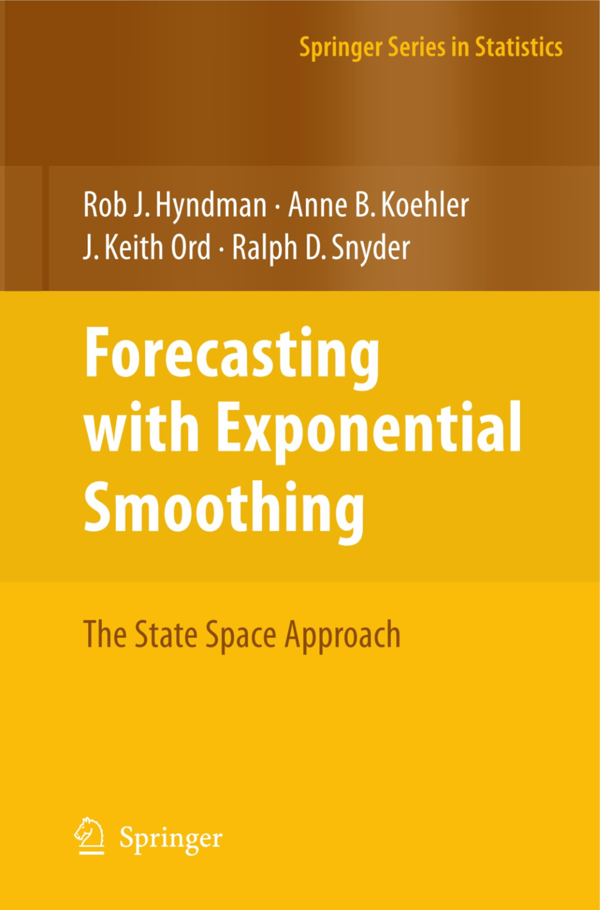

```{r setup, include = FALSE}
knitr::opts_chunk$set(
  collapse = TRUE,
  comment = "#>"
)
library(tidyverse)
library(forecast)
library(expsmooth)
library(gridExtra)

data("bonds")
data("usnetelec")
data("ukcars")
data("visitors")
```

# Introduction
This package contains a collection of datasets and functions that are designed to accompany the textbook "Forecasting with Exponential Smoothing: The State Space Approach" by Rob Hyndman, Anne B. Koehler, J. Keith Ord, Ralph D. Snyder (Wiley, 3rd ed., 1998). The book can be purchased [here](https://www.amazon.com/Forecasting-Exponential-Smoothing-Approach-Statistics/dp/3540719164).

```{r, echo=FALSE, out.width = "400px", fig.align='center'}

```

This vignette will replicate **Section 2.8** from the textbook, and provide worked solutions to some of the exercises in **Section 2.9**. The data sets that are used have been updated since the book was published so the values and models that are calculated and chosen in the vignette may be different from those in the textbook. A note will be made anywhere that this is the case. <br/>
<br/>

# Data Sets
A graph of a time series often exhibits patterns, such as an upward or downward movement (trend) or a pattern that repeats (seasonal variation), that might be used to forecast future values. Chapters 1 and 2 reference four data sets that are included in the `expsmooth` package. Each one can be loaded with the command `data("data_name")` once the `expsmooth` package has been loaded with `library(expsmooth)`.<br/>
<br/>

The names and descriptions of these data sets are given below:

- **bonds** <br/>
    125 monthly US government bond yields (percent per annum) from January 1994 to May 2004. <br/>
    Data structure:
    + `ts` object
    + **row names** represent years (1994 - 2004)
    + **column names** represent the months of the year
    + **values** represent the bond yield (percent per annum)
<br/><br/>

- **usnetelec** <br/>
    55 observations of annual US net electricity generation (billion kwh) for 1949 through 2003. <br/> 
    Data structure - this time series is defined with a yearly frequency so has a start year, an end year, and values:
    + `ts` object
    + **Start** is 1949, the first year in the series (the furthest in the past)
    + **End** is 2003, the last year in the series (the most recent year)
    + **values** represent the net electricity generation (billion kwh)
<br/><br/>

- **ukcars** <br/>
    113 quarterly observations of passenger motor vehicle production in the UK (thousands of cars) for the first quarter of 1977 through the first quarter of 2005. <br/>
    Data structure:
    + `ts` object
    + **row names** represent years (1977 - 2005)
    + **column names** represent the quarters of the year
    + **values** represent the number of cars produced (thousands of cars)
<br/><br/>

- **visitors** <br/>
    Figure 1.1d shows 240 monthly observations of the number of short term overseas visitors to Australia from May 1985 to April 2005. <br/>
    Data structure:
    + `ts` object
    + **row names** represent years (1985 - 2005)
    + **column names** represent the months of the year
    + **values** represent the number of visitors 
<br/><br/>

These time series are shown in **Figure 1.1** which is reproduced below:
```{r fig.width=7.15, fig.height=5}
plot_bonds <- autoplot(bonds) +
  ggtitle('(a) US 10-year Bonds Yield') +
  xlab('Year') +
  ylab('Percentage per Annum')

plot_usnetelec <- autoplot(usnetelec) +
  ggtitle('(b) US Net Electricity Generation') +
  xlab('Year') +
  ylab('Billion kWh')

plot_ukcars <- autoplot(ukcars) +
  ggtitle('(c) UK Passenger Vehicle Production') +
  xlab('Year') +
  ylab('Thousands of Cars')

plot_visitors <- autoplot(visitors) +
  ggtitle('(d) Overseas Visitors to Australia') +
  xlab('Year') +
  ylab('Thousands of People')

grid.arrange(plot_bonds, plot_usnetelec, plot_ukcars, plot_visitors, nrow=2)
```
<br/><br/>

# Model Selection Exercise
This part of the vignette will follow the methodology described in **Section 2.8** of the textbook, and reproduce the results that are reported there. This also provides answers to **Exercise 2.3** and **Exercise 2.4**. <br/>
<br/>
The estimation and model selection are performed by the `ets()` function and the forecasting is done by the `forecast()` function. These are both a part of the `forecast` package. A basic introduction to using these functions is given in **Section 7.6** and **Section 7.7** of ["Forecasting: Principles and Practice" by George Athanasopoulos and Rob J. Hyndman](https://otexts.org/fpp2/). <br/>
<br/>
The automatic forecasting process will by carried out for each data set described at the top of this vignette. The process will be explained for the first data set, and the relevant results will be reported for the others.

### bonds
The `ets()` function is used to apply all appropriate models (optimising parameters in each case), and then it also selects the best model according the the AICc. The AICc is the default penalised likelihood, but others can be specified. <br/>
```{r}
fit_bonds <- ets(bonds)
summary(fit_bonds)
```
<br/>
The `autoplot()` function can then be used to show the states over time. <br/>
```{r fig.width=7.15, fig.height=5}
autoplot(fit_bonds)
```
<br/>
The `forecast()` function is then used to produce point forecasts. The `forecast()` function also computes prediction intervals. When the `summary()` function is called on the forecast object, it prints all of the model parameters from above again, but also prints the values for the point forecasts together with the prediction intervals. Note that if no forecast horizon is entered via the `h` parameter, it will be set to a default of twice the frequency. <br/>
```{r}
forecast_bonds <- forecast(fit_bonds)
summary(forecast_bonds)
```
<br/>
The `autoplot()` function can then be called on the forecast object to produce the graph shown in **Figure 2.1**. <br/>
```{r fig.width=7.15, fig.height=5}
autoplot(forecast_bonds) +
  xlab('Year') +
  ylab('Percentage per Annum')
```

### usnetelec
```{r}
fit_usnetelec <- ets(usnetelec)
summary(fit_usnetelec)
```
```{r fig.width=7.15, fig.height=5}
autoplot(fit_usnetelec)
```
```{r}
forecast_usnetelec <- forecast(fit_usnetelec)
summary(forecast_usnetelec)
```
```{r fig.width=7.15, fig.height=5}
autoplot(forecast_usnetelec) +
  xlab('Year') +
  ylab('Percentage per Annum')
```

### ukcars
```{r}
fit_ukcars <- ets(ukcars)
summary(fit_ukcars)
```
```{r fig.width=7.15, fig.height=5}
autoplot(fit_ukcars)
```
```{r}
forecast_ukcars <- forecast(fit_ukcars)
summary(forecast_ukcars)
```
```{r fig.width=7.15, fig.height=5}
autoplot(forecast_ukcars) +
  xlab('Year') +
  ylab('Percentage per Annum')
```
### visitors
```{r}
fit_visitors <- ets(visitors)
summary(fit_visitors)
```
```{r fig.width=7.15, fig.height=5}
autoplot(fit_visitors)
```
```{r}
forecast_visitors <- forecast(fit_visitors)
summary(forecast_ukcars)
```
```{r fig.width=7.15, fig.height=5}
autoplot(forecast_visitors) +
  xlab('Year') +
  ylab('Percentage per Annum')
```


